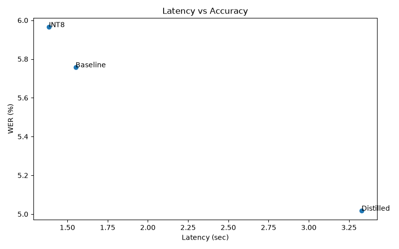
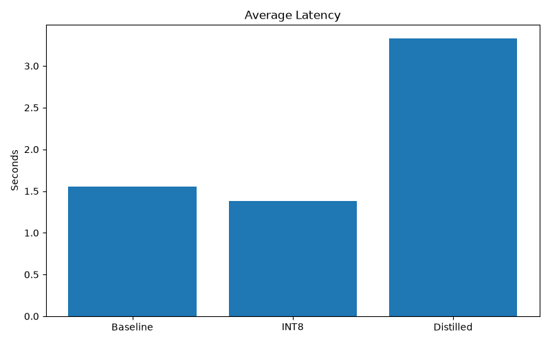
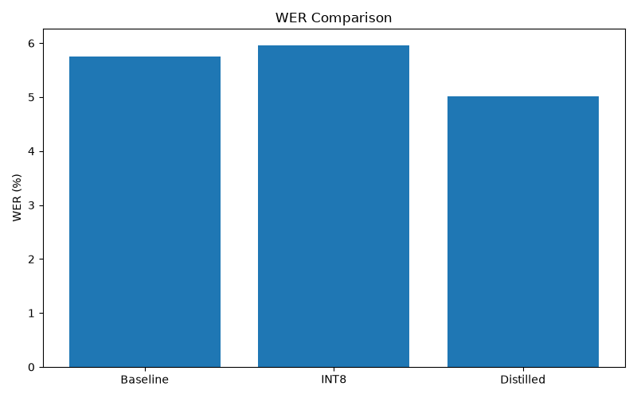

# Low-Latency ASR Benchmarking on CPU

## Overview

This project benchmarks Whisper-family Automatic Speech Recognition (ASR) models under CPU-only inference.

The objective is to evaluate latency, throughput, and transcription accuracy tradeoffs between:

- Whisper Base (FP32)
- Whisper Base INT8 Quantized
- Distil-Whisper

The benchmark simulates a production scenario where GPU infrastructure is unavailable or cost-prohibitive, and inference must be served efficiently using CPUs.

---

## Highlights

- Benchmarked ~2,620 utterances from LibriSpeech Test-Clean.
- Evaluated baseline, quantized, and distilled Whisper variants.
- Measured latency, throughput, Real-Time Factor (RTF), and Word Error Rate (WER).
- Implemented checkpoint/resume support for long-running benchmark runs.
- Compared quantization and distillation as two optimization strategies for CPU inference.
- Identified the optimal production deployment strategy for CPU-only ASR workloads.

---

## Final Results

| Model     | Avg Latency (s) | Throughput (utt/sec) | Avg RTF |   WER |
| --------- | --------------: | -------------------: | ------: | ----: |
| Baseline  |           1.551 |                0.645 |   0.280 | 5.76% |
| INT8      |           1.385 |                0.722 |   0.256 | 5.96% |
| Distilled |           3.328 |                0.301 |   0.618 | 5.02% |

### Key Takeaway

INT8 quantization reduced latency by approximately **10.7%** and increased throughput by approximately **12%** while incurring only **0.20% absolute WER degradation**, making it the best latency-accuracy tradeoff for CPU-only deployment.

---

## Benchmark Pipeline

```text
LibriSpeech Test-Clean
        │
        ▼
 Model Variant Loader
(Baseline / INT8 / Distilled)
        │
        ▼
 CPU Inference Runner
        │
        ├── Latency
        ├── Throughput
        ├── RTF
        └── Predictions
        │
        ▼
   WER Evaluation
        │
        ▼
 Results Aggregation
        │
        ▼
  Plots + Analysis
        │
        ▼
 Production Recommendation
```

---

## Dataset

Dataset:

```text
LibriSpeech Test-Clean
```

Characteristics:

- Approximately 2,620 audio utterances
- Multiple speakers
- Human-verified transcripts
- Fixed evaluation dataset across all experiments

This dataset remained unchanged across all benchmark runs to ensure fair model comparison.

---

## Benchmark Setup

Environment:

```text
Inference Backend : Faster-Whisper
Runtime           : CTranslate2
Device            : CPU
Dataset           : LibriSpeech Test-Clean
```

Models evaluated:

### Baseline

```text
Whisper Base
FP32
CPU Only
```

### Quantized

```text
Whisper Base
INT8 Quantized
CPU Only
```

### Distilled

```text
Distil-Whisper Small
CPU Only
```

---

## Metrics

The following evaluation metrics were collected.

### Latency

Average inference time per utterance.

### Throughput

Number of utterances processed per second.

### Real-Time Factor (RTF)

```text
Inference Time / Audio Duration
```

Lower values indicate faster inference.

### Word Error Rate (WER)

WER was calculated using JiWER after:

- Lowercasing
- Punctuation removal
- Whitespace normalization

This normalization ensures that formatting differences do not unfairly penalize transcription quality.

---

## Benchmark Results

### Latency vs Accuracy Tradeoff



### Latency Comparison



### WER Comparison



---

## Output

The benchmark produces:

- Model transcription outputs
- Per-utterance latency measurements
- Aggregate benchmark metrics
- WER evaluation reports
- Latency comparison charts
- Accuracy-vs-latency tradeoff visualizations
- Final deployment recommendation

---

## Key Findings

### INT8 Quantization

Compared with the FP32 baseline:

- ~10.7% lower latency
- ~12% higher throughput
- Only ~0.20% WER degradation

This delivered the strongest latency-to-accuracy tradeoff.

### Distillation

Distil-Whisper achieved the best transcription accuracy:

```text
WER = 5.02%
```

However:

- Latency increased significantly
- Throughput decreased substantially

On the tested hardware, distillation did not provide the expected deployment advantage over quantized inference.

---

## Recommendation

For CPU-only production deployment:

```text
Whisper Base INT8
```

is the preferred model because it provides:

- Lower latency
- Higher throughput
- Near-identical transcription quality

while requiring fewer computational resources.

Although Distil-Whisper achieved the lowest WER (5.02%), INT8 quantization delivered substantially better runtime performance while maintaining comparable accuracy.

---

## Project Structure

```text
cpu-asr-benchmark/
│
├── data/
│   └── transcripts.csv
│
├── evaluation/
│   ├── aggregate_metrics.py
│   ├── plot_results.py
│   └── wer_evaluator.py
│
├── results/
│   ├── plots/
│   │   ├── latency_comparison.png
│   │   ├── tradeoff_curve.png
│   │   └── wer_comparison.png
│   │
│   ├── predictions/
│   │   ├── baseline.csv
│   │   ├── distilled.csv
│   │   └── int8.csv
│   │
│   ├── final_summary.md
│   ├── metrics.csv
│   └── wer_results.csv
│
├── runners/
│   ├── baseline_runner.py
│   ├── quantized_runner.py
│   └── distilled_runner.py
│
├── utils/
│   ├── build_manifest.py
│   └── data_loader.py
│
├── config.py
├── requirements.txt
├── README.md
└── .gitignore
```

---

## Technologies

- Python
- Faster-Whisper
- CTranslate2
- JiWER
- Pandas
- NumPy
- Matplotlib
- Seaborn

---

## Reproducibility

### 1. Download Dataset

Download LibriSpeech Test-Clean and place it under:

```text
dataset/LibriSpeech/test-clean/
```

### 2. Install Dependencies

```bash
pip install -r requirements.txt
```

### 3. Run Benchmarks

```bash
python runners/baseline_runner.py
python runners/quantized_runner.py
python runners/distilled_runner.py
```

### 4. Evaluate Results

```bash
python evaluation/wer_evaluator.py
python evaluation/aggregate_metrics.py
python evaluation/plot_results.py
```

---

## Future Improvements

- Multi-thread CPU benchmarking
- CPU thread scaling analysis
- Memory consumption profiling
- Streaming ASR benchmarking
- Multilingual evaluation
- Dockerized benchmarking pipeline
- Production deployment benchmarking
